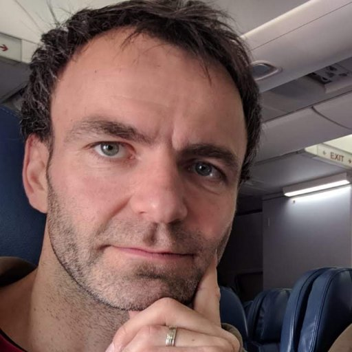

# 2020 Course : Neural Data Science with Python

This course provides a general introduction in the high-level, general-purpose porgramming lanuage [Python](https://www.python.org). 
It will furthermore cover basic analysis concepts used in the field of Neuroscience. 

### Objective of the Course 

The field of neuroscience is becoming more and more quantitative and this development is accompanied by
of an ever-increasing stream of data derived from the brain. It is essential that this development
is performed by neuroscientists who are ready and able to process this data. Data science is an emerging field
dedicated to understanding principles in data sets. This teaching unit aims to introduce the
principles data science applied to neural data.

Concretely, *Neural Data Science with Python* aims to teach how to handle, analyze, visualize neural data, to create models and to run simulations of neural systems
using the Python programming language. The students will be acquire to use different general and specific Python libraries
such as numpy, scipy, matplotlib, pandas, brian and the use of the Jupyter Notebook environment.

### Prerequisites

Bases in neuroanatomy and physiology of the central nervous system are useful. No prior knowledge in
programming is required as this course is for beginners.

### Competences Acquired

* Learning to program in Python.
* The basic principles of simple and advanced data analysis applied to neural data.
* The construction and implementation of single neuron and neural network simulations.

### What is Expected from You

* Curiosity and desire to learn.
* Active participation and contribution in particular during the tutorials.
* Feedback during the course and contributions to an open dialog to achieve on optimal learning experience.

### Lecture Organization and Material

Each course lasts for 2 hours. It consists of approximately 45 min lecture introducing the general motivation, scientific background and
analysis principles. The lecture is followed by an 1h 10 min long guided tutorial during which the programming/analysis is performed
by the students based on a pre-prepared [Jupyter Notebook](https://jupyter.org). Lecture and tutorial are separated by a short 5 min break.

All lectures and guided tutorials take place at **11h-13h on Wednesday's in room Durkheim, 2nd floor, access code: C2164, 45 rue des Saints-Pères** between **September 9th and December 2nd, 2020**.

**Lecture Overview**

| # | Date | Title | Lecturer |  Material |
| ------------- | ------------- | ------------- | ------------- | ------------- | 
| 1 | Sep 9th | Introduction to Python : first steps | Michael Graupner | [Lecture 1](lectures/L1_Introduction_Python.pdf), [Tutorial 1](tutorials/T01_Python-first-steps.ipynb), [Homework 1](exercises/E01_First-steps-in-Python.ipynb), Solutions  |
| 2 | Sep 16th | Time series : basic operations | Michael Graupner |  Lecture, Tutorial, Homework, Solutions   |
| 3 | Sep 23rd | Wrangling spike trains : basic analysis, raster plot, PSTH, Poisson spike trains | Michael Graupner | Lecture, Tutorial, Homework, Solutions |
| 4 | Sep 30th | Spectral analysis of analog signals : Fourier transform, Spectrogram, Signal Filtering | Michael Graupner | Lecture, Tutorial, Homework, Solutions |
| 5 | Oct 7th | Biophysical modelling of single neurons : integrate-and-fire neuron, introduction to numerical integration | Jonas Ranft | Lecture, Tutorial, Homework, Solutions  |
| 6 | Oct 14th | Spiking neural network simulation with Brian  | Marcel Stimberg | Lecture, Tutorial, Homework, Solutions  |
| 7 | Oct 21st | Regression analysis : correlation analysis, logisitic regression  | Michael Graupner | Lecture, Tutorial, Homework, Solutions   |
| 8 | Oct 28th | Dimensionality reduction : PCA, covariance matrix, factor extraction | Michael Graupner | Lecture, Tutorial, Homework, Solutions  |
| 9 | Nov 4th |Classification and clustering : SVM, KMeans estimate  | Michael Graupner | Lecture, Tutorial, Homework, Solutions |
|   | Nov 11th | Public holiday |  | |
| 10 | Nov 18th | Moving beyond linearity : nonlinear regression / End-of-Course projects presentation | Michael Graupner | Lecture, Tutorial, Homework, Solutions |
| 11 | Nov 25th | Bioinformatics and Systems biology I  | Karine  Audouze | Lecture, Tutorial, Homework, Solutions  |
| 12 | Dec 2nd | Bioinformatics and Systems biology II    | Karine  Audouze | Lecture, Tutorial, Homework, Solutions  |

### Course Evaluation

**Continuous control (50 % of the final mark) :** The students receive small **homework assignments** which are an extension of the 
in-course tutorial. The subject is related to the last course. The homeworks assignments with the respective Notebook file are posted in the **moodle** of the course. The results have **to be submitted through the
moodle by Wednesday 11am** before the next course (e.g., the assignments of the course on Wednesday Sep 9th have to be submitted by Wednesday Sep 16th
11am). Use the provided Jupyter Notebook (see table above or the moodle), add your edits to this file, and submit the modified Jupyter Notebook through the moodle.

**Final exam (50 % of the final mark) :** Students will receive a list of projects they will work on
for an extended period of time (about 1.5 months). Projects are small programming projects aimed at independently applying analysis methods acquired during the course. The project can be
worked on individually or in teams of two students.

All student work - the weekly homework assignments, the final report and talk - can prepared in English or French, up to the 
choice of the student. 

### Accessible Computer Rooms and Account

There are three computer rooms available outside the hours of the course. The machines in these rooms feature the same
Python installation as in the course and the same home directories (files stored during the course can be accessed 
from these machine) : 
*  Room **Durkheim** : left staircase from the main entrance hall to access lecture halls Delmas or balcon Binet, second floor (access code C2164). There are courses in that room during which it is not accessible.
*  Room **T209 bis** : 2nd floor, in front of Avogadro D, free access 
*  Room **T117** : 1st floor, free access 

You connect to your account on those machines - as well as on the classroom machines - with your university ENT login. 
The password is your birthdate in the format YYYYMMDD. It it highly recommended to change the default password, 
which can be done with the command `passwd` in a command line terminal. Please contact [Isabelle Moisenier](mailto:isabelle.moisenier@parisdescartes.fr) 
or [Luc Tamisier](mailto:Luc.Tamisier@parisdescartes.fr) in case of problems with the machines or your account. 

### Identification

M1 S1 Neuro

Code UE : NS0AM020

Acronym : DataSciPython

ECTS : 3

Time volume : 24 hours

### Language of the Course 

The dominant teaching language of the course with be English, while the lecturers provided by 
Karine Audouze will be in French with slides and material in English. 

### Course Organizers and Teachers  

The course is organized by [Michael Graupner](mailto:michael.graupner@parisdescartes.fr).
Lectures will furthermore be taught by [Jonas Ranfts](mailto:jonas.ranft@ens.fr),  [Karine Audouze](mailto:audouze.p7@gmail.com), and 
[Marcel Stimberg](mailto:marcel.stimberg@inserm.fr). All questions regarding access to your university account
can be addressed to  [Luc Tamisier](mailto:luc.tamisier@parisdescartes.fr) or
[Isabelle Moisenier](mailto:isabelle.moisenier@parisdescartes.fr).

Please direct all basic inquiries to [Michael Graupner](mailto:michael.graupner@parisdescartes.fr) by email or 
pass by his office : 

> Saints-Pères Paris Institute for the Neurosciences  
> CNRS UMR 8003, Université de Paris  
> bureau : H 358  
> 45 rue des Saints Pères  
> 75270 Paris Cedex 06  
> France

**Overview of all Lecturers**

| Picture | Name | Email | Address | 
| ------------- | ------------- | ------------- | ------------- | 
|  | Jonas Ranft | [jonas.ranft@ens.fr](mailto:jonas.ranft@ens.fr) | Ecole Normale Supérieure, Institute de Biologie, 46 rue d'Ulm  |
|  | Karine Audouze | [audouze.p7@gmail.com](mailto:audouze.p7@gmail.com) | Université de Paris, Systems Toxicology Group, 45 rue des Saints-Pères  |
|  | Marcel Stimberg | [marcel.stimberg@inserm.fr](mailto:marcel.stimberg@inserm.fr)  | Institut de la Vision, Computational Neuroscience of Sensory Systems, 17 rue Moreau |
|  | Michael Graupner | [michael.graupner@parisdescartes.fr](mailto:michael.graupner@parisdescartes.fr) | Université de Paris, SPPIN, 45 rue des Saints-Pères  |

### Python Requirements

All course material will run smoothly on the classroom machines, which will have all the required libraries installed. 

In case you want to run the course material on your private computer, the following packages are required : 
* Python 3.5 (or the current common versions 3.6, 3.7)
* numpy
* scipy
* jupyter
* matplotlib 
* pandas
* xlrd 
* biopython
* scikit-learn
* [Brian2](http://briansimulator.org/)

